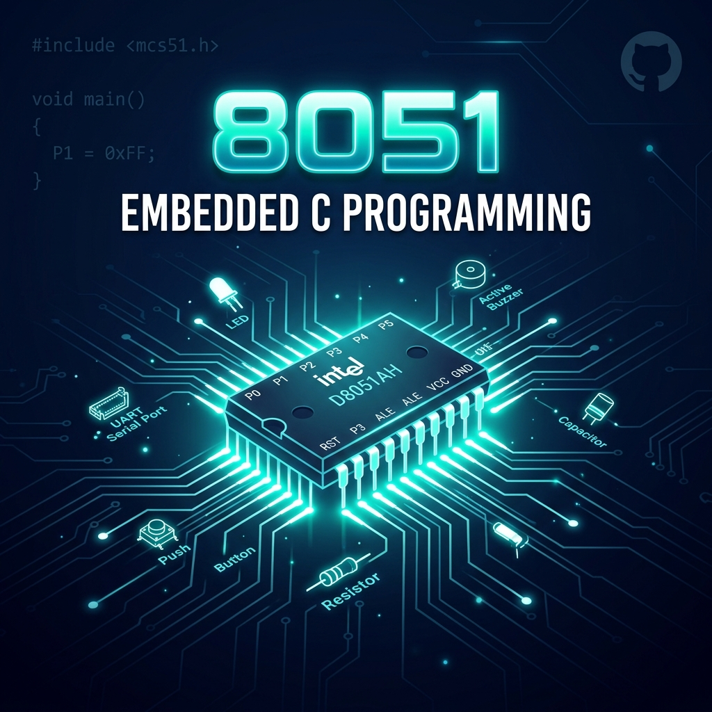

<p align="center">
  
</p>

<h1 align="center">⚡ Embedded C Basics — 8051 Microcontroller</h1>

<p align="center">
  <strong>A curated collection of 8051 Embedded C programs — from port I/O to serial communication</strong>
</p>

<p align="center">
  
  
  
  
</p>

<p align="center">
  <a href="#-about-the-8051">8051 Overview</a> •
  <a href="#-architecture">Architecture</a> •
  <a href="#-code-examples">Code Examples</a> •
  <a href="#-getting-started">Getting Started</a> •
  <a href="#-concepts-covered">Concepts</a>
</p>

---

## 📖 About the 8051

The **Intel 8051** (MCS-51) is one of the most widely used microcontroller families in embedded systems education and industry. Originally developed by Intel in 1981, it remains the foundation for learning embedded programming due to its clean architecture and rich peripheral set.

### Why Learn the 8051?

| Reason | Description |
|--------|-------------|
| 🎓 **Educational Foundation** | Perfect first microcontroller — simple yet complete architecture |
| 🏭 **Industry Relevance** | Billions of 8051-based chips deployed worldwide in appliances, automotive, and IoT |
| 🧱 **Architectural Clarity** | Harvard architecture, clear register map, well-documented peripherals |
| 🔧 **Rich Peripherals** | Timers, UART, interrupts, and 4 bidirectional I/O ports built-in |
| 📚 **Ecosystem** | Massive community, toolchain support (Keil, SDCC), and learning resources |

---

## 🏗 Architecture

### Pin Diagram (40-Pin DIP)

```
                    ┌──────────┐
        P1.0  ── 1  │          │ 40 ── VCC
        P1.1  ── 2  │          │ 39 ── P0.0 (AD0)
        P1.2  ── 3  │          │ 38 ── P0.1 (AD1)
        P1.3  ── 4  │          │ 37 ── P0.2 (AD2)
        P1.4  ── 5  │          │ 36 ── P0.3 (AD3)
        P1.5  ── 6  │   8051   │ 35 ── P0.4 (AD4)
        P1.6  ── 7  │          │ 34 ── P0.5 (AD5)
        P1.7  ── 8  │          │ 33 ── P0.6 (AD6)
         RST  ── 9  │          │ 32 ── P0.7 (AD7)
  (RXD) P3.0  ── 10 │          │ 31 ── EA/VPP
  (TXD) P3.1  ── 11 │          │ 30 ── ALE/PROG
 (INT0) P3.2  ── 12 │          │ 29 ── PSEN
 (INT1) P3.3  ── 13 │          │ 28 ── P2.7 (A15)
   (T0) P3.4  ── 14 │          │ 27 ── P2.6 (A14)
   (T1) P3.5  ── 15 │          │ 26 ── P2.5 (A13)
   (WR) P3.6  ── 16 │          │ 25 ── P2.4 (A12)
   (RD) P3.7  ── 17 │          │ 24 ── P2.3 (A11)
       XTAL2  ── 18 │          │ 23 ── P2.2 (A10)
       XTAL1  ── 19 │          │ 22 ── P2.1 (A9)
         GND  ── 20 │          │ 21 ── P2.0 (A8)
                    └──────────┘
```

### Memory Map

```
┌─────────────────────────────────┐
│       CODE MEMORY (ROM)         │
│  0000h ┌───────────────────┐    │    ┌─────────────────────────────┐
│        │ Interrupt Vectors │    │    │      DATA MEMORY (RAM)      │
│  0023h ├───────────────────┤    │    │                             │
│        │                   │    │    │  00h ┌─────────────────┐    │
│        │   User Program    │    │    │      │ Register Banks  │    │
│        │      Space        │    │    │  1Fh ├─────────────────┤    │
│        │                   │    │    │  20h │ Bit-Addressable │    │
│        │                   │    │    │  2Fh ├─────────────────┤    │
│  FFFFh └───────────────────┘    │    │  30h │ General Purpose │    │
│        (64 KB max)              │    │  7Fh ├─────────────────┤    │
└─────────────────────────────────┘    │  80h │      SFRs       │    │
                                       │  FFh └─────────────────┘    │
                                       └─────────────────────────────┘
```

### Key Special Function Registers (SFRs)

| Register | Address | Purpose |
|----------|---------|---------|
| `P0` | `0x80` | Port 0 — bidirectional I/O, multiplexed address/data bus |
| `P1` | `0x90` | Port 1 — bidirectional I/O (no alternate function) |
| `P2` | `0xA0` | Port 2 — bidirectional I/O, high-order address bus |
| `P3` | `0xB0` | Port 3 — bidirectional I/O with alternate functions (UART, INT, Timer) |
| `TMOD` | `0x89` | Timer Mode — configures Timer 0 and Timer 1 modes |
| `TCON` | `0x88` | Timer Control — start/stop timers, edge-triggered interrupts |
| `TH0/TL0` | `0x8C/0x8A` | Timer 0 high/low byte |
| `TH1/TL1` | `0x8D/0x8B` | Timer 1 high/low byte |
| `SCON` | `0x98` | Serial Control — UART mode, receive enable, flags |
| `SBUF` | `0x99` | Serial Buffer — TX/RX data register |
| `PCON` | `0x87` | Power Control — SMOD bit for baud rate doubling |
| `ACC` | `0xE0` | Accumulator — primary working register |
| `PSW` | `0xD0` | Program Status Word — carry, auxiliary carry, parity flags |

---

## 📂 Code Examples

This repository contains **13 progressively structured programs** covering core 8051 concepts:

### 🔌 Module 1 — Port I/O Operations

| # | File | Concept | Description |
|---|------|---------|-------------|
| 01 | [`01_port_read_write_with_delay.c`](01_port_read_write_with_delay.c) | Port Read/Write | Reads byte from P0, writes to P2 with software delay |
| 02 | [`02_conditional_port_routing.c`](02_conditional_port_routing.c) | Conditional Logic | Routes P0 input to P1 or P2 based on threshold value (100) |
| 03 | [`03_bit_addressable_toggle.c`](03_bit_addressable_toggle.c) | Bit Toggle | Continuously toggles a single bit (P2.4) using `sbit` |
| 04 | [`04_bit_input_conditional_output.c`](04_bit_input_conditional_output.c) | Bit Input | Reads single bit from P1.5 and outputs pattern to P0 |
| 05 | [`05_door_sensor_buzzer_alarm.c`](05_door_sensor_buzzer_alarm.c) | Real-World I/O | Door sensor on P1.1 triggers buzzer alarm on P1.7 |

### 🔧 Module 2 — Advanced I/O & Data Manipulation

| # | File | Concept | Description |
|---|------|---------|-------------|
| 06 | [`06_sfr_direct_port_access.c`](06_sfr_direct_port_access.c) | SFR Addressing | Direct SFR register declaration and port access |
| 07 | [`07_single_bit_io_transfer.c`](07_single_bit_io_transfer.c) | Bit Variable | Uses `bit` data type to transfer between pins |
| 08 | [`08_bcd_to_ascii_conversion.c`](08_bcd_to_ascii_conversion.c) | BCD → ASCII | Unpacks BCD byte (0x29) and converts each nibble to ASCII |
| 09 | [`09_ascii_to_bcd_packing.c`](09_ascii_to_bcd_packing.c) | ASCII → BCD | Packs two ASCII digits (5, 9) into a single BCD byte (0x59) |
| 10 | [`10_serial_bit_extraction.c`](10_serial_bit_extraction.c) | Bit Extraction | Serially extracts and outputs each bit of a byte via accumulator |

### 📡 Module 3 — Timers & Serial Communication

| # | File | Concept | Description |
|---|------|---------|-------------|
| 11 | [`11_timer1_square_wave_generator.c`](11_timer1_square_wave_generator.c) | Timer Mode 1 | Generates 50Hz square wave on P2.3 using Timer 1 |
| 12 | [`12_serial_uart_receiver.c`](12_serial_uart_receiver.c) | UART Receive | Receives serial data via SBUF and outputs to P1 |
| 13 | [`13_serial_dual_baud_transmitter.c`](13_serial_dual_baud_transmitter.c) | UART Transmit | Dual baud-rate serial transmitter with SMOD control |

---

## 🔬 Concepts Covered

### 1. Port I/O — Byte & Bit Level

The 8051 has **four 8-bit I/O ports** (P0–P3), each pin individually controllable.

**Byte-level access** — read/write all 8 pins at once:
```c
#include <reg51.h>
P0 = 0xFF;              // Set all P0 pins HIGH (configure as input)
unsigned char val = P0;  // Read entire port
P2 = val;               // Write entire byte to P2
```

**Bit-level access** — control individual pins using `sbit`:
```c
sbit LED    = P2^4;     // Name pin P2.4 as "LED"
sbit SENSOR = P1^1;     // Name pin P1.1 as "SENSOR"
LED = 1;                // Turn ON
LED = 0;                // Turn OFF
```

**The `bit` data type** — store single-bit values in bit-addressable RAM (20h–2Fh):
```c
bit flag;               // Declare 1-bit variable
flag = SENSOR;          // Read pin into bit variable
LED = flag;             // Write bit variable to pin
```

> 📌 **Key Insight**: To read a port pin, you must first write `1` to it (set as input). Writing `0` forces the pin LOW as output.

---

### 2. SFR (Special Function Register) Access

SFRs occupy addresses **80h–FFh** in the 8051's internal RAM. You can either include `<reg51.h>` or declare them manually:

```c
// Method 1: Using header (recommended)
#include <reg51.h>       // P0, P1, P2, P3 pre-defined

// Method 2: Direct SFR declaration
sfr P0 = 0x80;          // Port 0 at address 80h
sfr P1 = 0x90;          // Port 1 at address 90h
sfr P2 = 0xA0;          // Port 2 at address A0h
```

> 📌 **When to use direct SFR**: Accessing non-standard SFRs in 8051 variants, or when working without the standard header.

---

### 3. BCD ↔ ASCII Conversion

Essential for displays, keypads, and serial communication:

```
BCD to ASCII:          ASCII to BCD:
┌────────────┐         ┌────────────┐
│ 0x29 (BCD) │         │ '5'  '9'   │
├────────────┤         ├────────────┤
│ Split into │         │ Mask with  │
│  0x02 0x09 │         │   0x0F     │
├────────────┤         ├────────────┤
│ OR with    │         │ Shift & OR │
│   0x30     │         │            │
├────────────┤         ├────────────┤
│ '2'  '9'   │         │ 0x59 (BCD) │
└────────────┘         └────────────┘
```

---

### 4. Timer Programming

The 8051 has **2 timers** (Timer 0 & Timer 1), each with 4 modes:

| Mode | Name | Description |
|------|------|-------------|
| 0 | 13-bit Timer | 8-bit timer + 5-bit prescaler |
| 1 | **16-bit Timer** | Full 16-bit counter (most common) |
| 2 | **8-bit Auto-Reload** | Auto-reloads from THx — ideal for baud rate |
| 3 | Split Timer | Timer 0 splits into two 8-bit timers |

**TMOD Register Layout:**

```
  Bit:    7      6      5      4      3      2      1      0
       ┌──────┬──────┬──────┬──────┬──────┬──────┬──────┬──────┐
       │ GATE │ C/T  │  M1  │  M0  │ GATE │ C/T  │  M1  │  M0  │
       └──────┴──────┴──────┴──────┴──────┴──────┴──────┴──────┘
       ├──── Timer 1 ─────────────┤├──── Timer 0 ─────────────┤
```

**Square Wave Generation (from Example 11):**
```c
TMOD = 0x10;     // Timer 1, Mode 1 (16-bit)
TH1  = 0xDC;     // Load high byte
TL1  = 0x00;     // Load low byte  → Delay ≈ 10ms for 50Hz
TR1  = 1;        // Start timer
while(TF1 == 0); // Wait for overflow
TR1  = 0;        // Stop timer
TF1  = 0;        // Clear overflow flag
```

---

### 5. Serial Communication (UART)

The 8051 has a **built-in full-duplex UART** using pins P3.0 (RXD) and P3.1 (TXD).

**SCON Register Layout:**

```
  Bit:    7      6      5      4      3      2      1      0
       ┌──────┬──────┬──────┬──────┬──────┬──────┬──────┬──────┐
       │ SM0  │ SM1  │ SM2  │ REN  │ TB8  │ RB8  │  TI  │  RI  │
       └──────┴──────┴──────┴──────┴──────┴──────┴──────┴──────┘
```

| SCON Value | Mode | Description |
|------------|------|-------------|
| `0x50` | Mode 1, REN=1 | 8-bit UART, receiver enabled |
| `0x40` | Mode 1, REN=0 | 8-bit UART, transmit only |

**Baud Rate Calculation (Timer 1, Mode 2):**

```
                    Oscillator Frequency
Baud Rate = ─────────────────────────────────────
             32 × 12 × (256 − TH1)    [SMOD=0]

                    Oscillator Frequency
Baud Rate = ─────────────────────────────────────
             16 × 12 × (256 − TH1)    [SMOD=1]
```

**Common Baud Rates (11.0592 MHz Crystal):**

| Baud Rate | TH1 Value | SMOD |
|-----------|-----------|------|
| 9600 | `0xFD` | 0 |
| 4800 | `0xFA` | 0 |
| 2400 | `0xF4` | 0 |
| 9600 | `0xFA` | 1 |
| 19200 | `0xFD` | 1 |

**SMOD Baud Rate Doubling (from Example 13):**
```c
PCON = PCON | 0x80;  // Set SMOD bit = 1 → doubles baud rate
```

---

## 🚀 Getting Started

### Prerequisites

| Tool | Purpose | Download |
|------|---------|----------|
| **Keil µVision 5** | IDE + C51 Compiler | [keil.com/c51](https://www.keil.com/c51/) |
| **Proteus** (optional) | Circuit simulation | [labcenter.com](https://www.labcenter.com/) |
| **8051 Dev Board** (optional) | Hardware testing | AT89S52 / AT89C51 boards |

### Compilation Steps

```bash
# 1. Clone the repository
git clone https://github.com/AdityaTakuli/Embedded-C-Basics.git
cd Embedded-C-Basics

# 2. Open Keil µVision
#    → Project → New µVision Project
#    → Select target device: AT89C51 (or AT89S52)

# 3. Add source file
#    → Right-click "Source Group 1" → Add Existing Files
#    → Select the .c file you want to compile

# 4. Build
#    → Project → Build Target (F7)
#    → Check Output window for 0 Errors

# 5. Flash (Hardware) or Simulate (Proteus)
#    → Debug → Start/Stop Debug Session (Ctrl+F5)
```

### Project Structure

```
Embedded-C-Basics/
├── 📄 README.md
├── 📁 assets/
│   └── 🖼️ banner.png
│
├── ── Module 1: Port I/O ──────────────────────
├── 📝 01_port_read_write_with_delay.c
├── 📝 02_conditional_port_routing.c
├── 📝 03_bit_addressable_toggle.c
├── 📝 04_bit_input_conditional_output.c
├── 📝 05_door_sensor_buzzer_alarm.c
│
├── ── Module 2: Data Manipulation ─────────────
├── 📝 06_sfr_direct_port_access.c
├── 📝 07_single_bit_io_transfer.c
├── 📝 08_bcd_to_ascii_conversion.c
├── 📝 09_ascii_to_bcd_packing.c
├── 📝 10_serial_bit_extraction.c
│
├── ── Module 3: Timers & Serial ───────────────
├── 📝 11_timer1_square_wave_generator.c
├── 📝 12_serial_uart_receiver.c
└── 📝 13_serial_dual_baud_transmitter.c
```

---

## 📊 8051 Quick Reference Card

### Data Types in Embedded C (Keil C51)

| Type | Size | Range | Use Case |
|------|------|-------|----------|
| `bit` | 1 bit | 0–1 | Single pin/flag |
| `unsigned char` | 1 byte | 0–255 | Port data, counters |
| `signed char` | 1 byte | −128 to 127 | Signed arithmetic |
| `unsigned int` | 2 bytes | 0–65535 | Delay loops, addresses |
| `sbit` | 1 bit | — | Named bit in SFR |
| `sfr` | 1 byte | — | Named SFR register |

### Keil C51 Keywords (8051-Specific)

```c
sfr   P0 = 0x80;       // Declare Special Function Register
sbit  LED = P2^4;       // Declare bit within an SFR
bit   flag;             // Declare bit variable (bit-addressable RAM)
code  char msg[] = "Hi"; // Store in ROM (code memory)
data  char x;           // Store in direct RAM (00-7Fh, fastest)
idata char y;           // Store in indirect RAM (00-FFh)
xdata char z;           // Store in external RAM (up to 64KB)
```

### Common Bit Manipulation Patterns

```c
// Set bit
P1 = P1 | 0x04;       // Set bit 2 of P1

// Clear bit
P1 = P1 & ~0x04;      // Clear bit 2 of P1

// Toggle bit
P1 = P1 ^ 0x04;       // Toggle bit 2 of P1

// Check bit
if (P1 & 0x04) { }    // Test if bit 2 is set

// Extract nibbles
low  = byte & 0x0F;   // Lower nibble
high = (byte >> 4);    // Upper nibble

// Pack nibbles
packed = (high << 4) | low;
```

---

## 🧪 Interrupt Vector Table

| Interrupt | Vector Address | Flag | Priority |
|-----------|---------------|------|----------|
| External 0 (INT0) | `0x0003` | IE0 | Highest |
| Timer 0 | `0x000B` | TF0 | ↓ |
| External 1 (INT1) | `0x0013` | IE1 | ↓ |
| Timer 1 | `0x001B` | TF1 | ↓ |
| Serial (UART) | `0x0023` | TI/RI | Lowest |

---

## 📚 Learning Path

```
  START
    │
    ▼
┌─────────────────────┐     Programs
│  1. Port I/O Basics │ ──→ 01, 02
│     (Byte-level)    │
└─────────┬───────────┘
          │
          ▼
┌─────────────────────┐
│  2. Bit-Level I/O   │ ──→ 03, 04, 05
│     (sbit, bit)     │
└─────────┬───────────┘
          │
          ▼
┌─────────────────────┐
│  3. SFR & Advanced  │ ──→ 06, 07
│     I/O Patterns    │
└─────────┬───────────┘
          │
          ▼
┌─────────────────────┐
│  4. Data Conversion │ ──→ 08, 09, 10
│   (BCD, ASCII, Bit) │
└─────────┬───────────┘
          │
          ▼
┌─────────────────────┐
│  5. Timer Programs  │ ──→ 11
│     (TMOD, TCON)    │
└─────────┬───────────┘
          │
          ▼
┌─────────────────────┐
│  6. Serial (UART)   │ ──→ 12, 13
│   (SCON, SBUF)      │
└─────────┴───────────┘
          │
          ▼
       COMPLETE ✅
```

---

## 🤝 Contributing

Contributions are welcome! If you'd like to add more examples:

1. **Fork** this repository
2. **Create** a new branch (`git checkout -b feature/new-example`)
3. **Follow** the naming convention: `XX_descriptive_name.c`
4. **Add** clear comments in your code
5. **Submit** a Pull Request

---

## 📜 License

This project is open source and available under the [MIT License](LICENSE).

---

## ⭐ Show Your Support

If this repository helped you learn 8051 programming, give it a ⭐ — it motivates more content!

---

<p align="center">
  <sub>Built with 💻 and ⚡ by <a href="https://github.com/AdityaTakuli">Aditya Takuli</a></sub>
</p>
